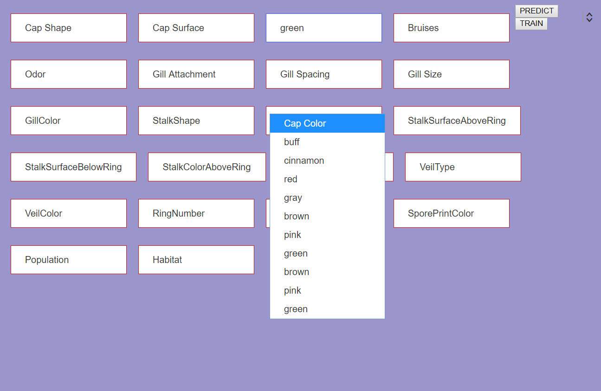

# Mushroom_Classifier
Mushroom edibility classifier application using Naïve Bayes classifier with Laplace smoothing in Django framework. Wrote unit test cases using PyUnit and wrote automated test cases using selenium web-driver.

This Ui allows user to select the characterstics of the mushroom from 22 catagories such as color, type, structure, shape etc.  which are used to classify the mushroom using Naïve Bayes classifier.

